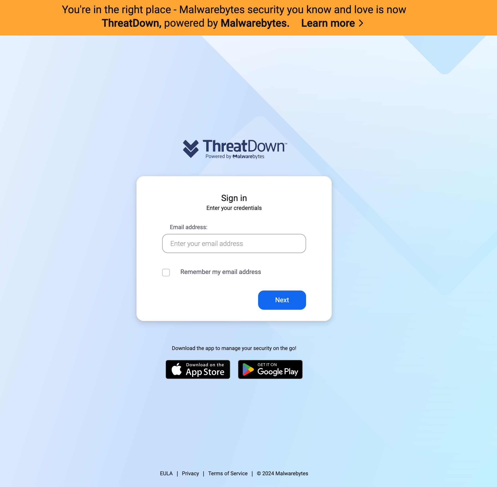

[comment]: # "Auto-generated SOAR connector documentation"
# ThreatDown Nebula

Publisher: ThreatDown  
Connector Version: 2\.0\.1  
Product Vendor: ThreatDown  
Product Name: Malwarebytes Endpoint Protection  
Product Version Supported (regex): "\.\*"  
Minimum Product Version: 6\.1\.1  

This app integrates with the ThreatDown Nebula platform to perform prevention, detection, remediation, and forensics endpoint management tasks

[comment]: # " File: README.md"
[comment]: # "  Copyright (c) ThreatDown, 2019-2024"
[comment]: # ""
[comment]: # "Licensed under the Apache License, Version 2.0 (the 'License');"
[comment]: # "you may not use this file except in compliance with the License."
[comment]: # "You may obtain a copy of the License at"
[comment]: # ""
[comment]: # "    http://www.apache.org/licenses/LICENSE-2.0"
[comment]: # ""
[comment]: # "Unless required by applicable law or agreed to in writing, software distributed under"
[comment]: # "the License is distributed on an 'AS IS' BASIS, WITHOUT WARRANTIES OR CONDITIONS OF ANY KIND,"
[comment]: # "either express or implied. See the License for the specific language governing permissions"
[comment]: # "and limitations under the License."
[comment]: # ""
## Authentication

The ThreatDown Nebula App uses the same Cloud console credential to authenticate and issue RESTful API
commands.

### Configuration Variables
The below configuration variables are required for this Connector to operate.  These variables are specified when configuring a ThreatDown Endpoint Protection asset in SOAR.

VARIABLE | REQUIRED | TYPE | DESCRIPTION
-------- | -------- | ---- | -----------
**accountid** |  required  | string | ThreatDown Nebula Account ID
**clientid** |  required  | string | ThreatDown Nebula Client ID
**clientsecret** |  required  | password | ThreatDown Nebula Client Secret

### Supported Actions  
[test connectivity](#action-test-connectivity) - Validate the asset configuration for connectivity using supplied configuration  
[scan and remediate](#action-scan-and-remediate) - Scan an endpoint and remediate threats found  
[scan and report](#action-scan-and-report) - Scan an endpoint and report threats found  
[isolate endpoint](#action-isolate-endpoint) - When threats are found, isolate a network, process, or desktop endpoint  
[isolate process](#action-isolate-process) - When threats are found, isolate a process endpoint  
[isolate network](#action-isolate-network) - Network Isolation on an endpoint when threats are found  
[isolate desktop](#action-isolate-desktop) - Desktop Isolation an endpoint when threats are found  
[deisolate endpoint](#action-deisolate-endpoint) - Deisolate endpoint after threats are removed  
[list endpoints](#action-list-endpoints) - List all the endpoints/sensors configured on the device  
[get endpoint info](#action-get-endpoint-info) - Get information about an endpoint  
[get scan info](#action-get-scan-info) - Get information about a scan job  

## action: 'test connectivity'
Validate the asset configuration for connectivity using supplied configuration

Type: **test**  
Read only: **True**

#### Action Parameters
No parameters are required for this action

#### Action Output
No Output  

## action: 'scan and remediate'
Scan an endpoint and remediate threats found

Type: **generic**  
Read only: **False**

#### Action Parameters
PARAMETER | REQUIRED | DESCRIPTION | TYPE | CONTAINS
--------- | -------- | ----------- | ---- | --------
**hostname** |  required  | Hostname of endpoint to scan and remediate | string |  `host name` 

#### Action Output
DATA PATH | TYPE | CONTAINS
--------- | ---- | --------
action\_result\.status | string | 
action\_result\.parameter\.hostname | string |  `host name` 
action\_result\.data | string | 
action\_result\.summary | string | 
action\_result\.message | string | 
summary\.total\_objects | numeric | 
summary\.total\_objects\_successful | numeric |   

## action: 'scan and report'
Scan an endpoint and report threats found

Type: **generic**  
Read only: **False**

#### Action Parameters
PARAMETER | REQUIRED | DESCRIPTION | TYPE | CONTAINS
--------- | -------- | ----------- | ---- | --------
**hostname** |  required  | Hostname of endpoint to scan and report | string |  `host name` 

#### Action Output
DATA PATH | TYPE | CONTAINS
--------- | ---- | --------
action\_result\.status | string | 
action\_result\.parameter\.hostname | string |  `host name` 
action\_result\.data | string | 
action\_result\.summary | string | 
action\_result\.message | string | 
summary\.total\_objects | numeric | 
summary\.total\_objects\_successful | numeric |   

## action: 'isolate endpoint'
When threats are found, isolate a network, process, or desktop endpoint

Type: **contain**  
Read only: **False**

#### Action Parameters
PARAMETER | REQUIRED | DESCRIPTION | TYPE | CONTAINS
--------- | -------- | ----------- | ---- | --------
**hostname** |  required  | Hostname of endpoint to isolate | string |  `host name` 

#### Action Output
DATA PATH | TYPE | CONTAINS
--------- | ---- | --------
action\_result\.status | string | 
action\_result\.parameter\.hostname | string |  `host name` 
action\_result\.data | string | 
action\_result\.summary | string | 
action\_result\.message | string | 
summary\.total\_objects | numeric | 
summary\.total\_objects\_successful | numeric |   

## action: 'isolate process'
When threats are found, isolate a process endpoint

Type: **contain**  
Read only: **False**

#### Action Parameters
PARAMETER | REQUIRED | DESCRIPTION | TYPE | CONTAINS
--------- | -------- | ----------- | ---- | --------
**hostname** |  required  | Hostname of endpoint to isolate | string |  `host name` 

#### Action Output
DATA PATH | TYPE | CONTAINS
--------- | ---- | --------
action\_result\.status | string | 
action\_result\.parameter\.hostname | string |  `host name` 
action\_result\.data | string | 
action\_result\.summary | string | 
action\_result\.message | string | 
summary\.total\_objects | numeric | 
summary\.total\_objects\_successful | numeric |   

## action: 'isolate network'
Network Isolation on an endpoint when threats are found

Type: **contain**  
Read only: **False**

#### Action Parameters
PARAMETER | REQUIRED | DESCRIPTION | TYPE | CONTAINS
--------- | -------- | ----------- | ---- | --------
**hostname** |  required  | Hostname of endpoint to isolate | string |  `host name` 

#### Action Output
DATA PATH | TYPE | CONTAINS
--------- | ---- | --------
action\_result\.status | string | 
action\_result\.parameter\.hostname | string |  `host name` 
action\_result\.data | string | 
action\_result\.summary | string | 
action\_result\.message | string | 
summary\.total\_objects | numeric | 
summary\.total\_objects\_successful | numeric |   

## action: 'isolate desktop'
Desktop Isolation an endpoint when threats are found

Type: **contain**  
Read only: **False**

#### Action Parameters
PARAMETER | REQUIRED | DESCRIPTION | TYPE | CONTAINS
--------- | -------- | ----------- | ---- | --------
**hostname** |  required  | Hostname of endpoint to isolate | string |  `host name` 

#### Action Output
DATA PATH | TYPE | CONTAINS
--------- | ---- | --------
action\_result\.status | string | 
action\_result\.parameter\.hostname | string |  `host name` 
action\_result\.data | string | 
action\_result\.summary | string | 
action\_result\.message | string | 
summary\.total\_objects | numeric | 
summary\.total\_objects\_successful | numeric |   

## action: 'deisolate endpoint'
Deisolate endpoint after threats are removed

Type: **correct**  
Read only: **False**

#### Action Parameters
PARAMETER | REQUIRED | DESCRIPTION | TYPE | CONTAINS
--------- | -------- | ----------- | ---- | --------
**hostname** |  required  | Hostname of endpoint to deisolate | string |  `host name` 

#### Action Output
DATA PATH | TYPE | CONTAINS
--------- | ---- | --------
action\_result\.status | string | 
action\_result\.parameter\.hostname | string |  `host name` 
action\_result\.data | string | 
action\_result\.summary | string | 
action\_result\.message | string | 
summary\.total\_objects | numeric | 
summary\.total\_objects\_successful | numeric |   

## action: 'list endpoints'
List all the endpoints/sensors configured on the device

Type: **investigate**  
Read only: **True**

#### Action Parameters
No parameters are required for this action

#### Action Output
DATA PATH | TYPE | CONTAINS
--------- | ---- | --------
action\_result\.status | string | 
action\_result\.data\.\*\.machines\.\*\.created\_at | string | 
action\_result\.data\.\*\.machines\.\*\.id | string | 
action\_result\.data\.\*\.machines\.\*\.last\_seen\_at | string | 
action\_result\.data\.\*\.machines\.\*\.name | string | 
action\_result\.data\.\*\.machines\.\*\.online | boolean | 
action\_result\.data\.\*\.machines\.\*\.os\_architecture | string | 
action\_result\.data\.\*\.machines\.\*\.os\_platform | string | 
action\_result\.data\.\*\.machines\.\*\.os\_release\_name | string | 
action\_result\.data\.\*\.total\_count | numeric | 
action\_result\.summary | string | 
action\_result\.message | string | 
summary\.total\_objects | numeric | 
summary\.total\_objects\_successful | numeric |   

## action: 'get endpoint info'
Get information about an endpoint

Type: **investigate**  
Read only: **True**

#### Action Parameters
PARAMETER | REQUIRED | DESCRIPTION | TYPE | CONTAINS
--------- | -------- | ----------- | ---- | --------
**hostname** |  required  | Hostname of the endpoint to get information | string |  `host name` 

#### Action Output
DATA PATH | TYPE | CONTAINS
--------- | ---- | --------
action\_result\.status | string | 
action\_result\.parameter\.hostname | string |  `host name` 
action\_result\.data\.\*\.created\_at | string | 
action\_result\.data\.\*\.id | string | 
action\_result\.data\.\*\.last\_seen\_at | string | 
action\_result\.data\.\*\.name | string | 
action\_result\.data\.\*\.online | boolean | 
action\_result\.data\.\*\.os\_architecture | string | 
action\_result\.data\.\*\.os\_platform | string | 
action\_result\.data\.\*\.os\_release\_name | string | 
action\_result\.summary | string | 
action\_result\.message | string | 
summary\.total\_objects | numeric | 
summary\.total\_objects\_successful | numeric |   

## action: 'get scan info'
Get information about a scan job

Type: **investigate**  
Read only: **True**

#### Action Parameters
PARAMETER | REQUIRED | DESCRIPTION | TYPE | CONTAINS
--------- | -------- | ----------- | ---- | --------
**scan\_id** |  required  | Scan ID for the job | string |  `scan id` 

#### Action Output
DATA PATH | TYPE | CONTAINS
--------- | ---- | --------
action\_result\.status | string | 
action\_result\.parameter\.scan\_id | string |  `scan id` 
action\_result\.data\.\*\.deleted\_count | numeric | 
action\_result\.data\.\*\.duration\_seconds | numeric | 
action\_result\.data\.\*\.found\_count | numeric | 
action\_result\.data\.\*\.from\_cloud | boolean | 
action\_result\.data\.\*\.id | string | 
action\_result\.data\.\*\.machine\_id | string | 
action\_result\.data\.\*\.machine\_name | string | 
action\_result\.data\.\*\.ondemand | boolean | 
action\_result\.data\.\*\.os\_platform | string | 
action\_result\.data\.\*\.quarantined\_count | numeric | 
action\_result\.data\.\*\.reported\_at | string | 
action\_result\.data\.\*\.scan\_type | string | 
action\_result\.data\.\*\.started\_at | string | 
action\_result\.data\.\*\.started\_at\_local | string | 
action\_result\.data\.\*\.total\_count | numeric | 
action\_result\.summary | string | 
action\_result\.message | string | 
summary\.total\_objects | numeric | 
summary\.total\_objects\_successful | numeric | 